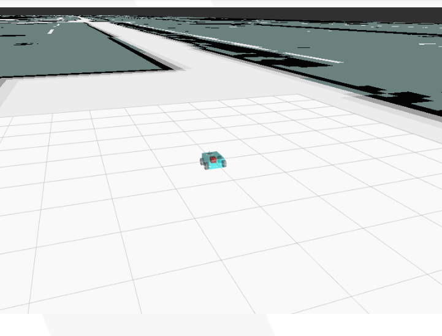

# ROS Workspace

ROS (Robot Operating System) is a popular framework for building robotic applications.  
It is a modular and extensible system that comes with a set of helpful tools and libraries.  
  
ROS can be used to build a navigation system for a veriety of robots, such as cars, drones, and home robots.  
  
This document shows how to set up ROS for an RC car based on Raspberry Pi.  


# How to run

## install docker on Raspberry pi  
please refer to [this blog](https://dev.to/elalemanyo/how-to-install-docker-and-docker-compose-on-raspberry-pi-1mo)  

## setup VPN
create an account on https://app.husarnet.com/  
and add the join code to the ```.env```  file  
  
you can skip this if you plan to use local network  

## start developement node :
```
cd Dooby-car/ROS/dev-node
docker-compose up --build
```
Open a browser and navigate to ```localhost:6080``` to access desktop environment    
open a terminal in the desktop environment and run:  
```
ros2 launch dooby_simulation bot.launch.py
```

## raspberry pi node : 
```
cd Dooby-car/ROS/pi-node
docker-compose up --build
```
the pi node runs dooby interface packages  

## server node :
```
cd Dooby-car/ROS/server-node
docker-compose up --build
```
the server node runs "Nav2" stack   

# Screenshots : 




